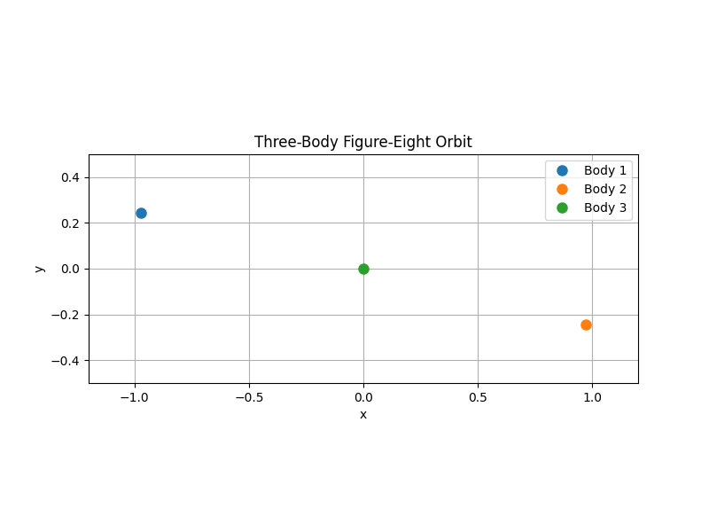
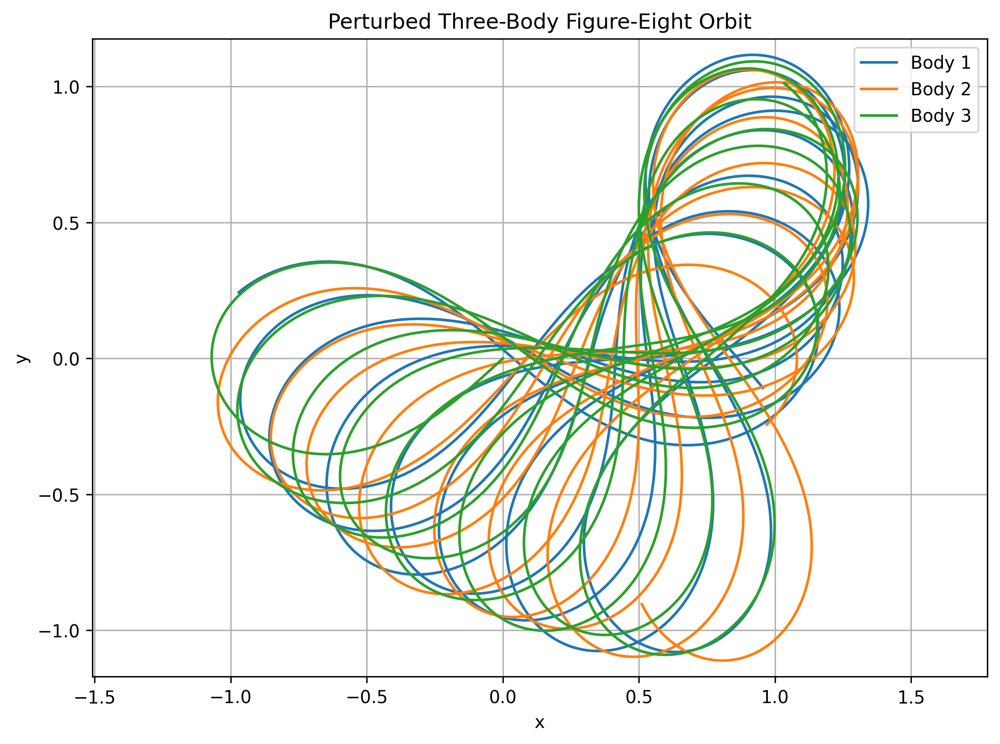
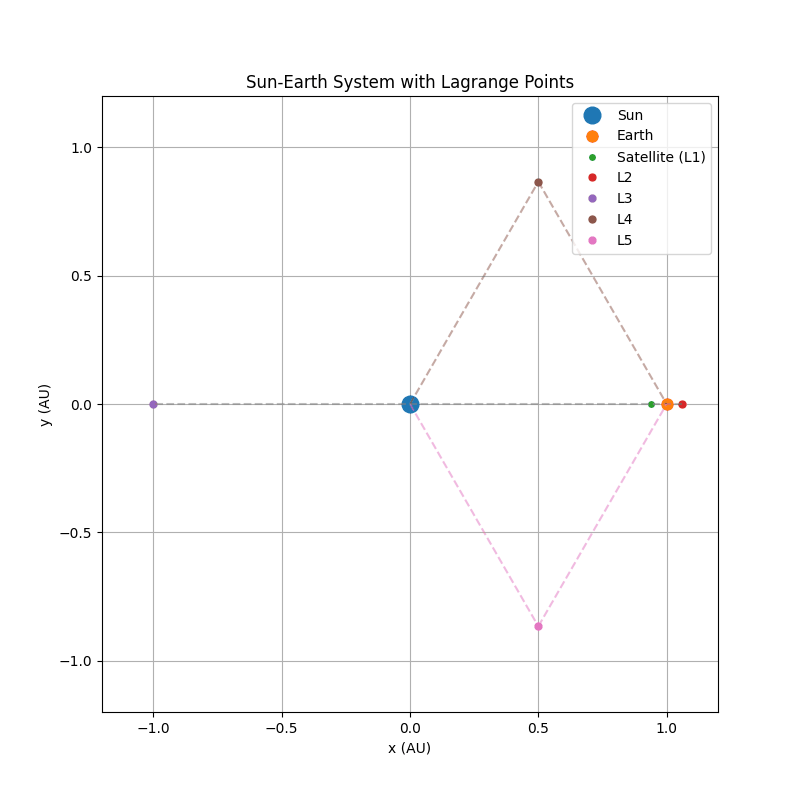

# ODE-Numerical-Methods
A collection of numerical methods for solving ordinary differential equations (ODEs), including mathematical formulations, implementations, and simulations.

## Figure-Eight orbit
This is a periodic, symmetric orbit in which the three bodies follow a figure-eight trajectory in the plane. The three bodies chase one another along the same figure-eight-shaped curve.
<p align="center">
  
</p>

## Perturbed Figure-Eight Orbit
The figure-eight orbit is a special periodic solution of the three-body problem. Its periodic motion depends strongly on the initial conditions. To demonstrate this sensitivity, a small perturbation of +0.05 is added only to the x-component of Body 1's initial velocity.


Although only one component of the initial conditions is changed, the trajectories gradually deviate from the original periodic figure-eight orbit, demonstrating the sensitivity of the three-body system to initial conditions.
<p align="center">
  
</p>

## Sun-Earth Lagrange Point Orbits
We consider the Sun-Earth system and place a satellite at L1. The five Lagrange points are locations where the gravitational effects of the Sun and Earth, together with the rotating-frame effect, allow a small object to remain stationary relative to the Sun and Earth in the ideal circular restricted three-body model.

**Note:** Since L1 and L2 are very close to the Earth compared with the Sun-Earth distance, their relative distances from the Earth are scaled by a factor of 6 for visualization. This scaling is applied only to the displayed positions and does not affect the numerical calculations or physical trajectories.
<p align="center">
  
</p>

## Directory Structure
```text
ODE-Numerical-Methods
│
├── Three-body-ODE/
└── 
```

## License
This project is released under the MIT License.
